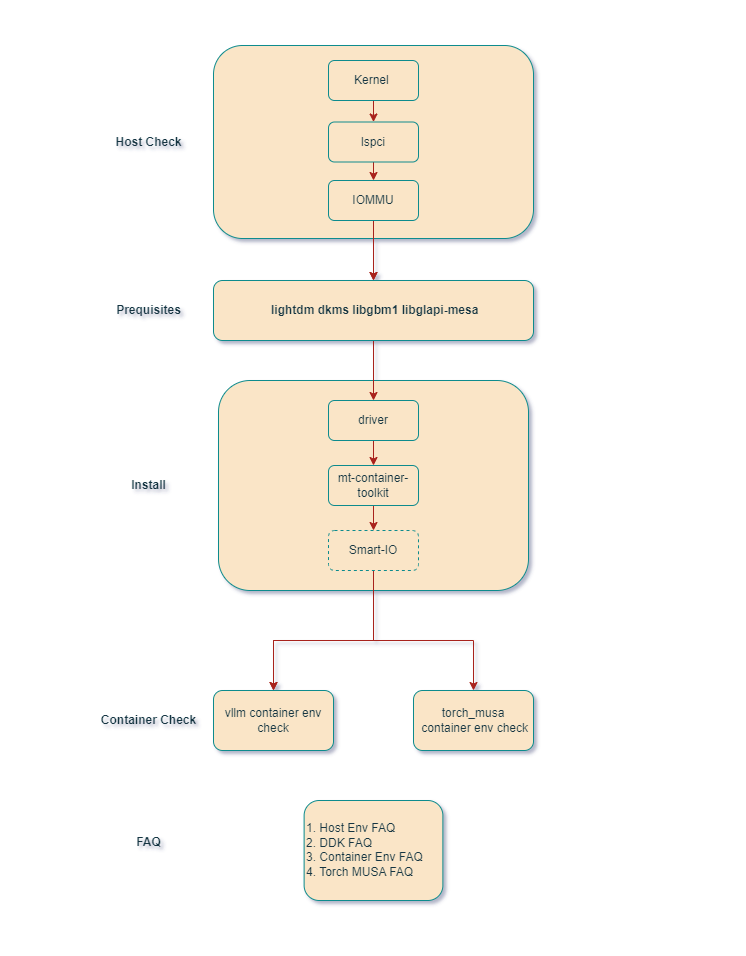

-----------------------

<!-- toc -->

- [setup\_musa](#setup_musa)
- [musa\_quick\_start](#musa_quick_start)
- [torch\_musa](#torch_musa)
- [vLLM](#vllm)
- [Open Resources](#open-resources)
  - [torch\_musa](#torch_musa-1)
    - [开发者文档](#开发者文档)
    - [开发者镜像文档](#开发者镜像文档)
    - [用户镜像文档](#用户镜像文档)
  - [vLLM文档](#vllm文档)
  - [MTTransformer镜像文档](#mttransformer镜像文档)
  - [摩尔学院](#摩尔学院)
  - [摩尔线程开发者网站](#摩尔线程开发者网站)
    - [摩尔线程博客中心](#摩尔线程博客中心)
    - [摩尔线程文档中心](#摩尔线程文档中心)
    - [摩尔线程GPU监控和管理工具](#摩尔线程gpu监控和管理工具)
    - [摩尔线程云原生套件安装及使用文档](#摩尔线程云原生套件安装及使用文档)
  - [摩尔线程CSDN社区](#摩尔线程csdn社区)
  - [镜像仓库](#镜像仓库)
  <!-- tocstop -->

## setup_musa

[setup_musa](./setup_musa)目录包含配置musa开发环境的文档和脚本，以及对musa环境检查的脚本。 用户可根据目录中文档进行环境配置，有问题可以参考[FAQ](./FAQ)目录解决。配置MUSA环境整体流程如下图所示，其中Check是可选项:

## musa_quick_start
[musa_quick_start](./musa_quick_start)目录包含了一些musa编程示例代码。用户可参考示例代码快速开始musa编程工作。

## torch_musa

| Models  | Mode      |
| ------- | --------- |
| [QuichStart](./pytorch/QuickStart)  | Training/Inference |
| [bge-m3](./pytorch/Embedding/bge_m3)  | Inference |
| [YOLOV5](./pytorch/cv/yolov5)  | Training/Inference |
| [YOLOV5](./pytorch/cpp/)  | Inference-cpp |
| [YOLOV7](./pytorch/cv/yolov7/) | Training/Inference |
| [YOLOV8](./pytorch/cv/yolov8/) | Training/Inference |
| [Resnet50](./pytorch/cv/resnet50/) | Training/Inference |
| [bert](./pytorch/nlp/bert/) | Training |
| [whisper](./pytorch/speech/whisper/) | Training/Inference |
| [maskrcnn](./pytorch/cv/maskrcnn/) | Training/Inference |
| [SwinTransformer](./pytorch/cv/swin_transformer/) | Training/Inference |
| [StableDiffusion-v1.5](./pytorch/multimodal/sd_1.5) | Training/Inference |
| [StableDiffusion-v2.1](./pytorch/multimodal/sd_2.1) | Inference |
| [StableDiffusion-xl](./pytorch/multimodal/sdxl) | Inference |
| [GOT-OCR](./pytorch/huggingface_demo/GOT-OCR) | Inference |
| [Llama-3.2-3B-Instruct](./pytorch/huggingface_demo/Llama-3.2-3B-Instruct) | Inference |
| [Meta-Llama-3-8B](./pytorch/huggingface_demo/Meta-Llama-3-8B) | Inference |
| [Mistral-7B-v0.1](./pytorch/huggingface_demo/Mistral-7B-v0.1) | Inference |
| [Qwen-VL-Chat](./pytorch/huggingface_demo/Qwen-VL-Chat) | Inference |
| [Qwen2-7B](./pytorch/huggingface_demo/Qwen2-7B) | Inference |
| [Qwen2.5-7B-Instruct](./pytorch/huggingface_demo/Qwen2.5-7B-Instruct) | Inference |
| [llava-interleave-qwen-0.5b-hf](./pytorch/huggingface_demo/llava-interleave-qwen-0.5b-hf) | Inference |

## vLLM

| Models        | Data Type     |
| ------------  | ------------- |
| [ChatGLM2](./vllm/models/ChatGLM2)        | FP16          |
| [ChatGLM3](./vllm/models/ChatGLM3)        | FP16          |
| [GLM4](./vllm/models/GLM4)        | FP16          |
| [Llama2](./vllm/models/Llama2)        | FP16          |
| [Llama3](./vllm/models/Llama3)        | FP16          |
| [Qwen2](./vllm/models/Qwen2)        | FP16          |

## Open Resources

### [Torch_musa](https://github.com/MooreThreads/torch_musa)

- [开发者文档](https://github.com/MooreThreads/torch_musa/blob/main/docs/)
- [开发者镜像文档](https://mcconline.mthreads.com/repo/musa-pytorch-dev-public?repoName=musa-pytorch-dev-public&repoNamespace=mcconline&displayName=Pytorch%20on%20MUSA%20Dev)
- [用户镜像文档](https://mcconline.mthreads.com/repo/musa-pytorch-release-public?repoName=musa-pytorch-release-public&repoNamespace=mcconline&displayName=Pytorch%20on%20MUSA%20Release)

### [vLLM文档](https://docs.mthreads.com/mtt/mtt-doc-online/)

### [MTTransformer镜像文档](https://mcconline.mthreads.com/repo/musa-pytorch-transformer?repoName=musa-pytorch-transformer&repoNamespace=mcconline&displayName=MT%20Transformer%20Release)

### [摩尔学院](https://academy.mthreads.com/)

### [摩尔线程开发者网站](https://developer.mthreads.com/)

- [摩尔线程博客中心](https://blog.mthreads.com/blog/musa/)

- [摩尔线程文档中心](https://docs.mthreads.com/)

- [摩尔线程GPU监控和管理工具](https://docs.mthreads.com/gmc/gmc-doc-online/user_manual/)

- [摩尔线程云原生套件安装及使用文档](https://docs.mthreads.com/cloud-native/cloud-native-doc-online/introduction/)

### [摩尔线程CSDN社区](https://bbs.csdn.net/forums/mthreads)

### [镜像仓库](https://mcconline.mthreads.com/repo)
