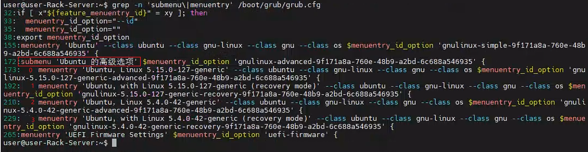

# 20.04适配kuae1.3(升降Kernel)


## 升级kernel

kuae1.3 环境推荐kernel版本为`5.15.0-105-generic`

### 1.1 安装特定Kernel版本

```shell
# 1. 查看已安装kernel安装列表
dpkg --get-selections |grep linux-image

# 2. 当前软件库是否存在预期的kernel版本，如果没有预期的版本，则需要额外配置仓库。
apt-cache search linux | grep linux-image-5.15.0-105-generic

# 3. 安装指定版本的 Kernel Image 和 Kernel Header。
sudo apt-get install linux-headers-5.15.0-105-generic linux-image-5.15.0-105-generic

# 4. 查看当前的Kernel列表
grep menuentry /boot/grub/grub.cfg
```

### 1.2 更换启动Kernel版本

#### 1.2.1 编辑grub文件

*   方式一

```shell
$ sudo vi /etc/default/grub

# GRUB_DEFAULT=0
GRUB_DEFAULT="Advanced options for Ubuntu>Ubuntu, with Linux 5.15.0-105-generic"
```

#### 1.2.2 更新grub

```shell
sudo update-grub
sudo reboot
```

#### 1.2.3 未生效处理

如果安装上面操作发现Kernel版本没有切换到预期版本, 做如下尝试:

1.  查看安装的kernel版本列表

```shell
$ grep -n 'submenu\|menuentry' /boot/grub/grub.cfg
```




2.  编辑/etc/default/grub

```shell
# 1. 编辑
sudo vim /etc/default/grub

# 2. 配置默认启动项
GRUB_DEFAULT="1>2"
```

> 结合上图示例（实际推荐版本为`5.15.0-105-generic`）, 选择启动项编号：

*   `0`: 默认条目 `Ubuntu`。

*   `1>`: `submenu` -> **高级选项**：

    *   `0`: `Ubuntu，Linux 5.15.0-127-generic`。

    *   `1`: `Ubuntu, with Linux 5.15.0-127-generic (recovery mode)`。

    *   `2`: `**Ubuntu，Linux 5.4.0-42-generic**`。