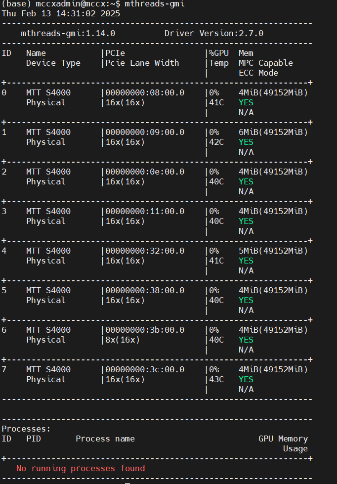
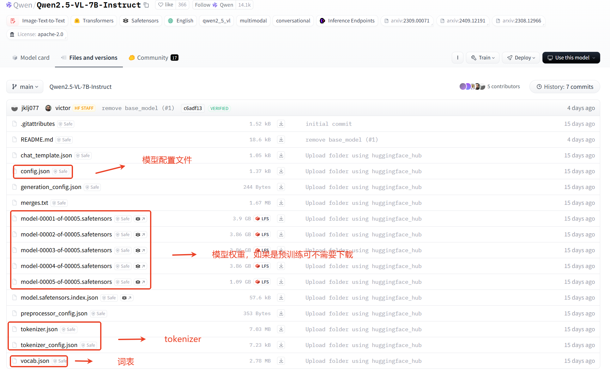
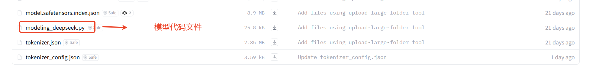
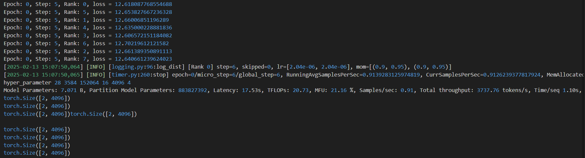

# LLM大模型训练用户指南
本文主要介绍如何通过DeepSpeed和Megatron拉起llm类大模型训练，具体目录如下，可点击跳转。

-[环境准备](#环境准备)

-[DeepSpeed训练](#DeepSpeed训练)


## 环境准备
推荐部署的方法为 docker 容器部署，轻便快速，无需对齐环境。
### 环境检查
通过以下命令检查是否已经安装驱动，如打印类似下图1-1的结果，可认为驱动正常安装。
```
mthreads-gmi
```

<center>图1-1：gmi返回结果</center> 

### 容器准备
使用如下命令拉起kuae镜像
```
docker run -it --privileged --net host --name=model_train -w /workspace -v /data:/data --env MTHREADS_VISIBLE_DEVICES=all --shm-size=80g sh-harbor.mthreads.com/mcc/test/mt-ai-kuae-qy2:v1.3.0-release-1031 /bin/bash 
```
关键参数解释
* --name=model_train 指定容器名称，不能和其他容器重名
* -w /workspace 指定工作目录
* -v /data:/data 映射目录，前者为物理机目录，后者为容器内访问的目录
* sh-harbor.mthreads.com/mcc/test/mt-ai-kuae-qy2:v1.3.0-release-1031 镜像名

软件栈和镜像对应关系可参考下表
|驱动版本|软件栈版本|对应镜像|
|---|---|---|
|20241025 release kuae1.3.0_musa3.1.0|kuae1.3|sh-harbor.mthreads.com/mcc/test/mt-ai-kuae-qy2:v1.3.0-release-1031|
驱动版本可使用如下命令查询
```
clinfo | grep "Driver"
```
## DeepSpeed训练
### 下载模型训练代码及模型配置文件
在[huggineface](https://huggingface.co/)下载需要训练的模型的文件，包含模型代码，模型配置文件，tokenizer、词表等

<center>图2-1：huggineface中qwen模型文件说明</center> 


<center>图2-2：huggineface中modeling_xxx文件</center> 

以Qwen2.5-7b为例：下载config.json、generation_config.json、merges.txt、tokenizer.json、tokenizer_config.json、vocab.json文件，将文件放到/home/musify_hub/deepspeed/qwen2_5_7b/目录下,可参考图2-1

注：
* 如果是预训练，模型权重文件可以不用下载。如图2-1qwen网络已在transformers中支持，作者就没有在huggineface等社区上传模型代码文件。如图2-2deepspeek有上传模型代码文件（一般为modeling_xxx.py）则需要下载
* 部分模型在transformers以支持，则不需要下载模型代码
* 如因网络问题，无法在huggineface下载，可以尝试使用[modelscpoe](https://www.modelscope.cn/home)或其他社区下载
* 镜像内/home/musify_hub/deepspeed/qwen2_5_7b/ 已包含Qwen2.5-7b模型文件，可直接使用。用户也可自行下载
### 使用DeepSpeed拉起训练
已经在kuae对应镜像内后，可直接执行以下命令拉起Qwen2.5-7B训练
```
cd /home/musify_hub/deepspeed
bash run_qwen2_5.sh
```
关键参数解释
* MUSA_VISIBLE_DEVICES='0,1,2,3,4,5,6,7' 指定device
* --model_name_or_path 模型文件所在路径
* --per_device_train_batch_size 每张卡上的batchsize，显存不够时可尝试减小batchsize
* --max_seq_len输入长度
* --gradient_accumulation_steps 梯度累计次数
* --gradient_checkpointing 启用梯度检查点功能
* --offload 允许将部分模型放到cpu内存中，可以减少显存消耗，但会降低吞吐
### 结果检查
日志保存在 output_qwen2_5_7b/training.log 中，正常训练下日志可参考下图2-3

<center>图2-3：使用DeepSpeed训练Qwen日志内容</center> 

### 停止训练
```
#手工杀掉进程(ctrl+c)，如果配置了ssh免密登录，可以使用以下命令
bash stop_all.sh
```
