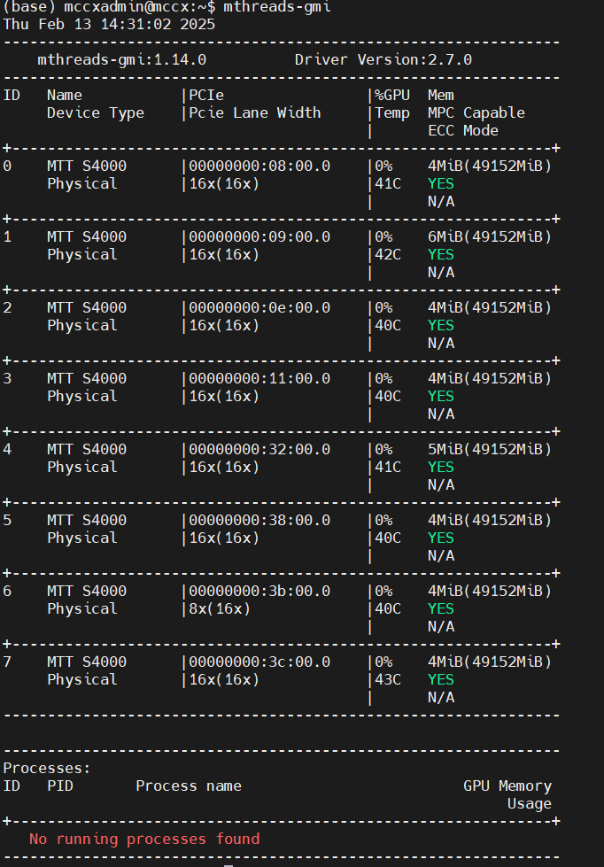

# LLM大模型训练用户指南
本文主要介绍如何通过FlagScale拉起llm类大模型训练，具体目录如下，可点击跳转。

-[环境准备](#环境准备)

-[FlagScale训练](#FlagScale训练)


## 环境准备
推荐部署的方法为 docker 容器部署，轻便快速，无需对齐环境。
### 环境检查
通过以下命令检查是否已经安装驱动，如打印类似下图1-1的结果，可认为驱动正常安装。
```
mthreads-gmi
```

<center>图1-1：gmi返回结果</center> 

### 容器准备
使用如下命令拉起kuae镜像
```
docker run -it --privileged --net host --name=model_train -w /workspace -v /data:/data --env MTHREADS_VISIBLE_DEVICES=all --shm-size=80g sh-harbor.mthreads.com/mcc/test/mt-ai-kuae-qy2:v1.3.0-release-1031 /bin/bash 
```
关键参数解释
* --name=model_train 指定容器名称，不能和其他容器重名
* -w /workspace 指定工作目录
* -v /data:/data 映射目录，前者为物理机目录，后者为容器内访问的目录
* sh-harbor.mthreads.com/mcc/test/mt-ai-kuae-qy2:v1.3.0-release-1031 镜像名

软件栈和镜像对应关系可参考下表
|驱动版本|软件栈版本|对应镜像|
|---|---|---|
|20241025 release kuae1.3.0_musa3.1.0|kuae1.3|sh-harbor.mthreads.com/mcc/test/mt-ai-kuae-qy2:v1.3.0-release-1031|

驱动版本可使用如下命令查询
```
clinfo | grep "Driver"
```
## FlagScale训练
### 使用FlagScale拉起llama2-7b训练
已经在kuae对应镜像内后，可直接执行以下命令拉起llama2-7b训练
```
cd /home/FlagScale/aquila/
bash pretrain_llama_7b_distribute.sh
```
关键参数解释
* TP_SIZE 指定TP切分组数
* PP_SIZE 指定PP_SIZE组数
* WORLD_SIZE 总卡数，DP切分组数为WORLD_SIZE / (TP_SIZE * PP_SIZE)
* MICRO_BATCH_SIZE流水线并行每次输入数据BatchSize
* DATA_DIR 数据集目录
* DATA_CACHE_PATH 数据集缓存目录
### 结果检查
日志保存在 output/()时间戳)/ 中，可新开一个窗口查看日志，正常训练下日志可参考下图2-1

<center>图2-1：使用FlagScale训练llama日志内容</center> 

### 停止训练
```
#手工杀掉进程或使用以下命令
bash dist_stop.sh
```
