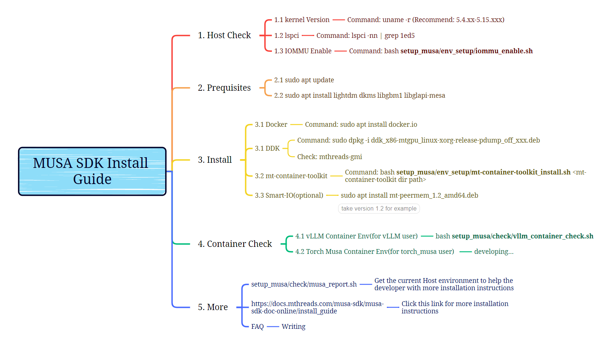

## MUSA SDK 安装指导

#  1. 检验环境

```shell
# (host)用来查看当前环境下cpu, 操作系统，驱动版本，mt-tainertoolkit版本等，并进行一些基本检查
sudo bash ./check/musa_report.sh

================================================
==================MUSA  Report==================
================================================
CPU:                             Intel(R)Xeon(R)Gold6430
Operation System:                Ubuntu 20.04.4 LTS
Kernel Version:                  5.4.0-42-generic
IOMMU:                           enabled
lspci GPU Number:                8
PCIE version:                    Gen5
MTBios Version:
                                 3.4.3
                                 3.4.3
                                 3.4.3
                                 3.4.3
                                 3.4.3
                                 3.4.3
                                 3.4.3
                                 3.4.3
MTLink Status:                   disabled
Driver Version(gmi):             1.2.0
Detail Driver Version(clinfo):   20240703 release-kuae-1.2.0
mthreads-gmi Version             1.12.2
Docker Version:                  20.10.24
MT-Container-Toolkit Version:    N/A
MT-Container-Toolkit Status:     successful
================================================
```

```shell
# (host)查看MTLink状态
bash ./check/check_mtlink.sh
```


#  2. 安装指南

- MUSA SDK资源下载: [摩尔线程开发者 | Moore Threads](https://developer.mthreads.com/sdk/download/musa?equipment=&os=&driverVersion=&version=)

- 详细安装过程参看下图:



